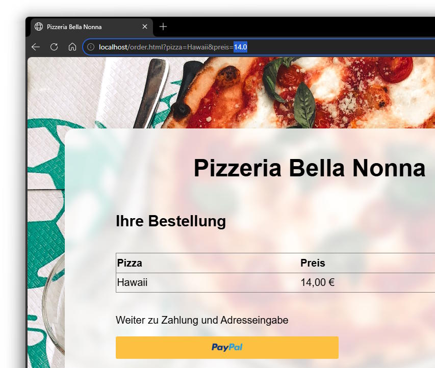

# pizzabellanonna-py

Eine Demo-Webanwendung mit Python (Bottle) und Datenbank (SQLite). Es handelt sich um die Bestell-Webseite der fiktiven Pizzeria "*Bella Nonna*". Man kann alle verfügbaren Pizzen anzeigen, durchsuchen und jeweils eine einzelne Pizza zur Lieferung bestellen.

Die Anwendung ist absichtlich anfällig für zwei Angriffe und dient als Demonstrator (siehe [Bedienung](#h-attacks)).

## Installation

Es gibt keine externe Abhängigkeiten (außer einer Python 3-Installation im System). Das Verzeichnis samt allen Dateien reicht aus, um den Demonstrator zu starten.

Start mit ``python bellanonna.py`` oder direkt aus einer IDE.

Die Webseite ist nun unter [http://localhost:80/](http://localhost:80/) erreichbar.

### Hinweis zur Versionsgeschichte

Dieses Projekt ist die Neuauflage von https://github.com/digitalvolk/PizzaBellaNonna mit Python und SQLite. Ziel war es, eine Umgebung zu schaffen, in der Schülerinnen und Schüler ohne Installation und Konfiguration von Web- und Datenbankservern direkt sichtbar Ergebnisse erzielen können. Das Python-Framework [Bottle](https://bottlepy.org/docs/dev/) bringt direkt einen Webserver mit und besteht nur aus einer Datei. [SQLite](https://www.sqlite.org/) als DBMS beschränkt sich ebenfalls auf eine Datei und ist bereits Bestandteil aktueller Python-Installationen ([sqlite3](https://docs.python.org/3/library/sqlite3.html)), ohne dass weitere Software installiert werden muss.

## Bedienung {#h-attacks}

Die Software kann in zwei Modi betrieben werden, wobei jeweils ein unterschiedlicher Angriff möglich ist.

Den Modus bestimmt die Software anhand der sich gegenseitig ausschließenden **Zeilen 45 und 47** in der Datei ``bellanonna.py``.

### Query String Injection

Für diesen Modus muss Zeile 45 aktiv sein und Zeile 47 auskommentiert werden.

Die Bestellseite ``/order.html`` bestimmt den Namen und den Preis der Pizza anhand der **GET**-Parameter. Man kann in der Adresszeile des Browsers leicht den Preis verändern.

**Schutz**: Keine internen Variablen in die Kontrolle des Endanwenders geben.

### SQL Injection

Für diesen Modus muss Zeile 45 auskommentiert werden und Zeile 47 aktiv sein.

Die Bestellseite bestimmt den Namen und den Preis der Pizza durch eine Datenbankabfrage. Der **GET**-Parameter identifiziert lediglich die ID der Pizza, nach welcher in der Datenbank gesucht wird.

Jedoch erfolgt keine Input sanitization, sodass statt der ID einer Pizza Teile einer SQL Query injected werden können.

So kann man dem Query String z.B. ``;UPDATE pizza SET cost = 3.5 WHERE id = 2;--`` anfügen, um den Preis der Pizza #2 auf 3,50 € zu senken.

Ebenso kann man die gesamte Datenbank leeren mittels ``;DELETE FROM pizza;--``.

Jede SQL injection erzeugt zwar einen HTTP-Fehler 500, die Änderungen an der Datenbank erfolgen jedoch und sind nach einem Reload der Webseite im Browser sichtbar.

**Schutz**: Generell Input sanitization, Verwendung von Parameterized queries oder gleich ORM.

### Wiederherstellung der Datenbank

Im Unterverzeichnis ``supplementary`` befindet sich eine Kopie der Originaldatenbank namens ``pizzas.sqlite.bak``.

## Warning

This repository contains teaching material and is **not fit for production environments**! Especially, parts of this code are intentionally insecure or employ disencouraged programming techniques.
